# SHODH-MEMORY MERMAID DIAGRAMS
## Copy-Paste Ready Diagrams for Documentation

**Version:** 1.0
**Date:** November 2025

**Usage:** Copy any diagram block below and paste into:
- GitHub README.md
- GitLab documentation
- Notion
- Obsidian
- Any markdown viewer with Mermaid support

---

## TABLE OF CONTENTS

1. [System Architecture Flowchart](#1-system-architecture-flowchart)
2. [Data Flow Pipeline](#2-data-flow-pipeline)
3. [Spreading Activation Algorithm](#3-spreading-activation-algorithm)
4. [Hybrid Scoring Breakdown](#4-hybrid-scoring-breakdown)
5. [Deployment Architecture](#5-deployment-architecture)
6. [API Endpoint Map](#6-api-endpoint-map)
7. [Knowledge Graph Structure](#7-knowledge-graph-structure)
8. [Retrieval Performance Comparison](#8-retrieval-performance-comparison)

---

## 1. SYSTEM ARCHITECTURE FLOWCHART

Complete end-to-end system architecture showing input to output flow.


---

## 2. DATA FLOW PIPELINE

Simplified data flow showing the path from sensor data to retrieved memories.

```mermaid
flowchart LR
    A[Drone Sensor Data] --> B[REST API<br/>Validation]
    B --> C[Entity Extraction<br/>IC: 2.3 nouns<br/>IC: 1.7 adjectives]
    B --> D[Embedding Model<br/>MiniLM-L6-v2]

    C --> E[(Knowledge Graph<br/>RocksDB)]
    D --> E

    E --> F[Spreading Activation<br/>A = A₀ × e^-λd]
    F --> G[Hybrid Scoring<br/>Graph 60%<br/>Semantic 25%<br/>Linguistic 15%]
    G --> H[Ranked Memories<br/>Score: 0.791, 0.628, ...]

    style A fill:#bbdefb
    style E fill:#f3e5f5
    style H fill:#c8e6c9
```



---

## 3. SPREADING ACTIVATION ALGORITHM

Visualization of how activation spreads through the knowledge graph (Anderson & Pirolli 1984).

```mermaid
graph TD
    %% Query Analysis
    Q["Query: red obstacle near waypoint<br/>─────────────<br/>Focal Entities: obstacle(2.3), waypoint(2.3)<br/>Modifiers: red(1.7)"]

    %% Initial Activation
    Q --> A[obstacle<br/>Activation: 2.3]
    Q --> B[waypoint<br/>Activation: 2.3]

    %% Hop 1 (decay = 0.606)
    A -->|strength: 0.9<br/>A: 2.3×0.606×0.9=1.25| C[sensor<br/>Activation: 1.25]
    A -->|strength: 0.8<br/>A: 2.3×0.606×0.8=1.12| D[robot<br/>Activation: 1.12]
    B -->|strength: 0.7<br/>A: 2.3×0.606×0.7=0.98| E[location<br/>Activation: 0.98]

    %% Hop 2 (decay = 0.368)
    C -->|strength: 0.8<br/>A: 1.25×0.368×0.8=0.37| F[lidar<br/>Activation: 0.37]
    D -->|strength: 0.6<br/>A: 1.12×0.368×0.6=0.25| G[navigation<br/>Activation: 0.25]

    %% Hop 3 (decay = 0.223)
    F -->|strength: 0.5<br/>A: 0.37×0.223×0.5=0.04| H[detection<br/>Activation: 0.04]
    G -.->|strength: 0.4<br/>A: 0.25×0.223×0.4=0.02<br/>PRUNED ❌| I[path<br/>Below threshold]

    %% Episode Connection
    A -.-> J[Episode #42<br/>Graph Score: 6.97]
    D -.-> J
    C -.-> J
    B -.-> J

    %% Styling
    classDef query fill:#fff9c4,stroke:#f57f17,stroke-width:3px
    classDef hop1 fill:#c5e1a5,stroke:#558b2f,stroke-width:2px
    classDef hop2 fill:#ffcc80,stroke:#e65100,stroke-width:2px
    classDef hop3 fill:#ef9a9a,stroke:#c62828,stroke-width:2px
    classDef pruned fill:#cfd8dc,stroke:#455a64,stroke-width:1px,stroke-dasharray: 5 5
    classDef episode fill:#ce93d8,stroke:#6a1b9a,stroke-width:3px

    class Q query
    class A,B hop1
    class C,D,E hop1
    class F,G hop2
    class H hop3
    class I pruned
    class J episode
```



---

## 4. HYBRID SCORING BREAKDOWN

How the final score is calculated using three independent signals (Xiong et al. 2017).

```mermaid
graph LR
    %% Input
    E[Episode #42<br/>Content: Lidar detected<br/>red obstacle at waypoint 5]

    %% Three Scoring Components
    E --> G1[Graph Activation<br/>━━━━━━━━━━━━<br/>Connected entities:<br/>obstacle: 2.3<br/>robot: 1.26<br/>sensor: 1.12<br/>waypoint: 2.3<br/>━━━━━━━━━━━━<br/>Total: 6.97<br/>Normalized: 0.871]

    E --> G2[Semantic Similarity<br/>━━━━━━━━━━━━<br/>Query embedding:<br/>[0.12, -0.34, 0.56, ...]<br/>Episode embedding:<br/>[0.15, -0.31, 0.58, ...]<br/>━━━━━━━━━━━━<br/>Cosine: 0.847]

    E --> G3[Linguistic Match<br/>━━━━━━━━━━━━<br/>Matched entities:<br/>obstacle ✓ 1.0<br/>waypoint ✓ 1.0<br/>Matched modifiers:<br/>red ✓ 0.5<br/>━━━━━━━━━━━━<br/>Score: 2.5/7.3 = 0.370]

    %% Weighting
    G1 -->|60% weight| F[Final Score<br/>━━━━━━━━━━━━<br/>0.60 × 0.871 = 0.523<br/>0.25 × 0.847 = 0.212<br/>0.15 × 0.370 = 0.056<br/>━━━━━━━━━━━━<br/>Total: 0.791]
    G2 -->|25% weight| F
    G3 -->|15% weight| F

    %% Styling
    style E fill:#e1f5fe
    style G1 fill:#c8e6c9
    style G2 fill:#fff9c4
    style G3 fill:#ffccbc
    style F fill:#ce93d8,stroke:#6a1b9a,stroke-width:3px
```

---

## 5. DEPLOYMENT ARCHITECTURE

Edge + Cloud hybrid deployment for optimal performance.

```mermaid
graph TB
    %% Drone Edge Layer
    subgraph Edge["🚁 DRONE (EDGE DEVICE)"]
        FC[Flight Controller<br/>Real-time decisions]
        LC[Local Cache<br/>Hot memories<br/>Latency: <10ms]
        FC <--> LC
    end

    %% Network
    Edge <-->|4G/5G<br/>Connection| Cloud

    %% Cloud Server Layer
    subgraph Cloud["☁️ CLOUD SERVER"]
        API[REST API Server<br/>Axum + Tokio]
        KG[(Knowledge Graph<br/>RocksDB + Vector Index)]
        BG[Background Services<br/>• Compression<br/>• Audit rotation<br/>• Index optimization]

        API --> KG
        KG --> BG
    end

    %% Operator Dashboard
    Cloud <--> Dashboard[🖥️ OPERATOR DASHBOARD<br/>• Mission monitoring<br/>• Graph visualization<br/>• Analytics]

    %% Styling
    style Edge fill:#e3f2fd,stroke:#1565c0,stroke-width:2px
    style Cloud fill:#f3e5f5,stroke:#6a1b9a,stroke-width:2px
    style Dashboard fill:#fff3e0,stroke:#e65100,stroke-width:2px
```



---

## 6. API ENDPOINT MAP

REST API endpoints organized by functionality.


---

## 7. KNOWLEDGE GRAPH STRUCTURE

Structure of the knowledge graph showing entities, relationships, and episodes.


---

## 8. RETRIEVAL PERFORMANCE COMPARISON

Benchmark results comparing Shodh-Memory with competitors.

```mermaid
%%{init: {'theme':'base'}}%%
graph LR
    subgraph Accuracy["Retrieval Accuracy (%)"]
        A1[Shodh-Memory<br/>████████████ 100%]
        A2[Mem0<br/>████████░░░░ 85%]
        A3[Cognee<br/>███████░░░░░ 78%]
        A4[Baseline<br/>██░░░░░░░░░░ 20%]
    end

    subgraph Latency["Query Latency (ms)"]
        L1[Shodh-Memory<br/>150-200ms<br/>Graph traversal]
        L2[Mem0<br/>~50ms<br/>Semantic only]
        L3[Cognee<br/>~80ms<br/>Direct lookup]
    end

    subgraph Diversity["Score Diversity σ"]
        D1[Shodh-Memory<br/>σ = 0.18<br/>Dynamic scores]
        D2[Mem0<br/>σ = 0.05<br/>Clustered]
        D3[Hardcoded<br/>σ = 0.00<br/>All same]
    end

    style A1 fill:#4caf50,color:#fff
    style A2 fill:#ff9800
    style A3 fill:#ff5722
    style A4 fill:#9e9e9e
    style L1 fill:#2196f3,color:#fff
    style L2 fill:#4caf50,color:#fff
    style L3 fill:#8bc34a
    style D1 fill:#9c27b0,color:#fff
    style D2 fill:#673ab7,color:#fff
    style D3 fill:#9e9e9e
```



---

## 9. LINGUISTIC QUERY ANALYSIS

How queries are parsed using IC-weighted POS classification (Lioma & Ounis 2006).


---

## 10. MEMORY LIFECYCLE

Complete lifecycle of a memory from recording to retrieval.


---

## USAGE INSTRUCTIONS

### For GitHub/GitLab README:
1. Copy the entire code block (including ```mermaid and ```)
2. Paste into your markdown file
3. Commit - it will render automatically

### For Documentation Sites:
- **Docusaurus**: Supports Mermaid natively
- **MkDocs**: Use `pymdown-extensions`
- **GitBook**: Use Mermaid plugin
- **Notion**: Paste as code block, select "Mermaid" language

### For Presentations:
1. Copy diagram code
2. Paste into https://mermaid.live
3. Export as PNG/SVG
4. Use in PowerPoint/Keynote

### Live Editor:
Test and customize at: https://mermaid.live

---

## CUSTOMIZATION TIPS

### Change Colors:


### Add Icons (with Font Awesome):


### Flowchart Styles:
- `graph TD` - Top to Down
- `graph LR` - Left to Right
- `graph BT` - Bottom to Top
- `graph RL` - Right to Left

### Line Styles:
- `A --> B` - Arrow
- `A -.-> B` - Dotted arrow
- `A ==> B` - Thick arrow
- `A --- B` - Line (no arrow)

---

**Mermaid Diagrams Version:** 1.0
**Last Updated:** November 2025
**Prepared for:** Drone Challenge Application

**All diagrams are copy-paste ready and will render in:**
✓ GitHub
✓ GitLab
✓ Notion
✓ Obsidian
✓ VS Code (with extension)
✓ Most modern markdown viewers
